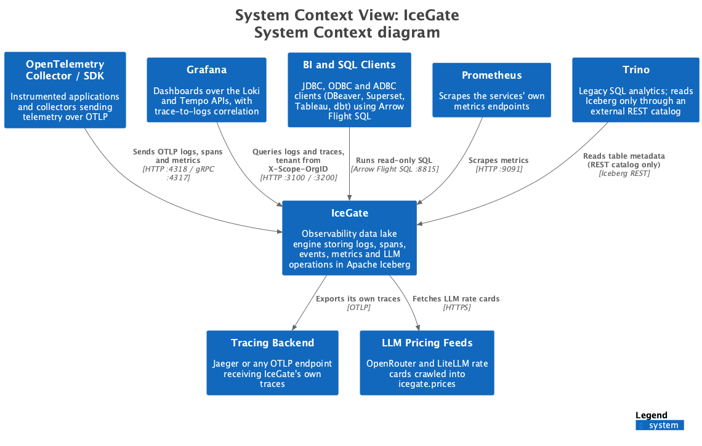
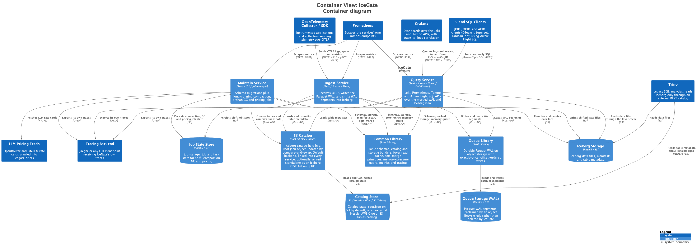
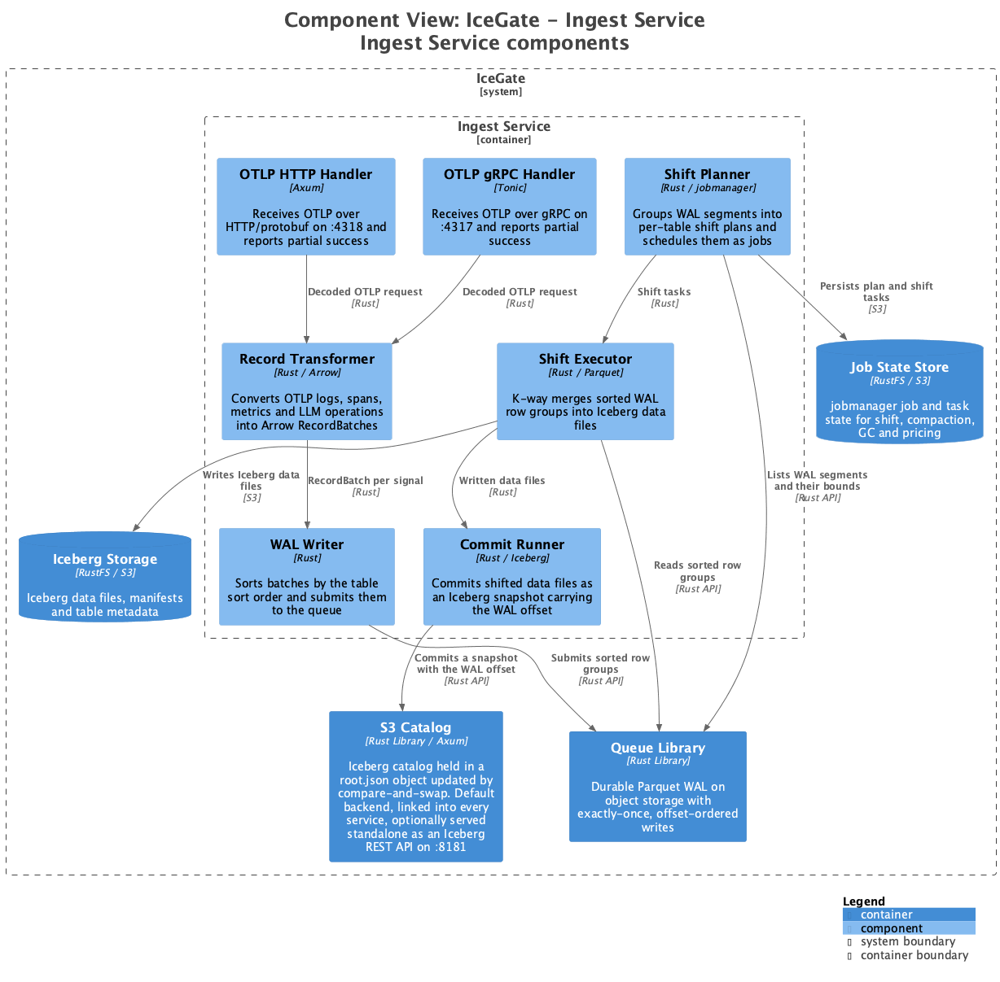
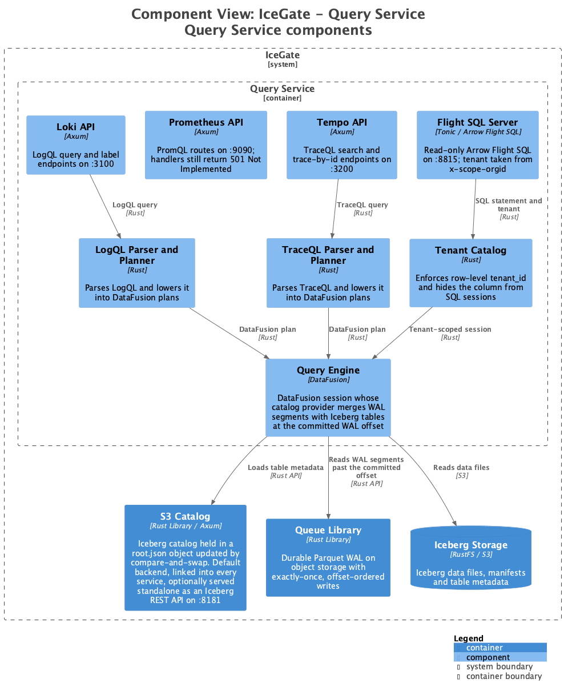
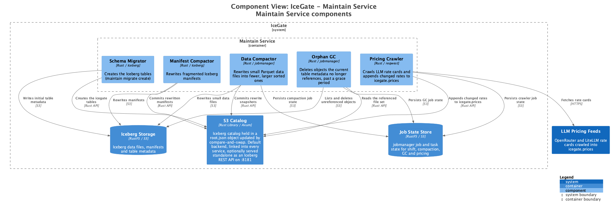
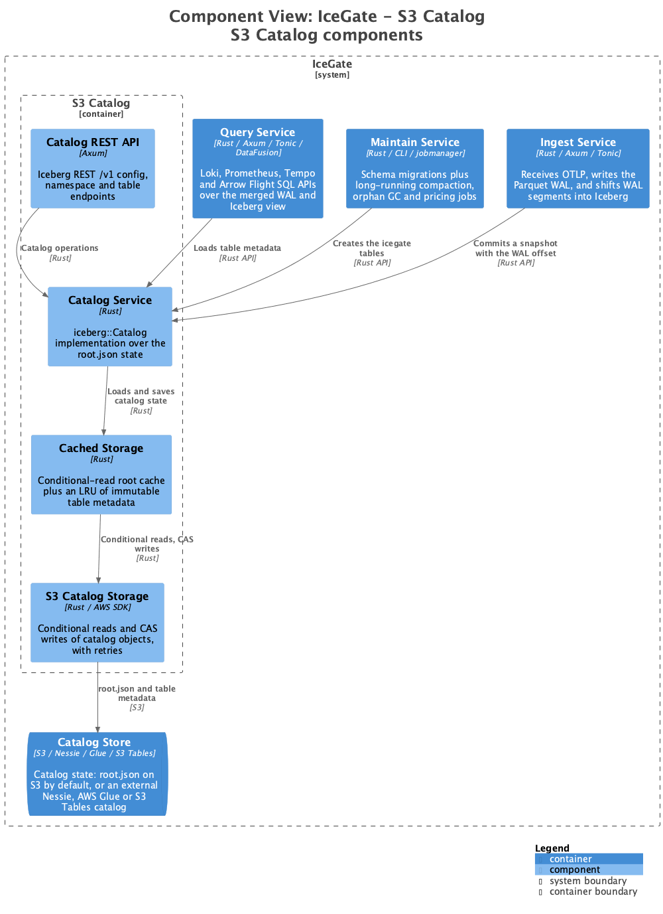

# Vue d'Ensemble de l'Architecture

{{product_name}} est un moteur de lac de données d'observabilité qui stocke les logs, traces, métriques, événements et opérations LLM dans des tables Apache Iceberg avec DataFusion comme moteur de requêtes.

## Principes de Conception

- **Séparation Calcul-Stockage** : Mise à l'échelle indépendante du traitement et du stockage
- **Standards Ouverts** : Construit sur Apache Iceberg, Arrow, Parquet et OpenTelemetry
- **Économique** : L'architecture basée sur le stockage objet minimise les coûts d'infrastructure
- **Transactions ACID** : Support complet des transactions sans base de données OLTP dédiée

## Contexte Système

## Diagramme des Conteneurs

## Détails des Composants

### Service Ingest

**Objectif :** Accepter les données d'observabilité via OpenTelemetry Protocol (OTLP)

- **Protocoles :** OTLP HTTP (port 4318), OTLP gRPC (port 4317)
- **Garantie de Livraison :** Exactly-once
- **Chemin d'Écriture :** Données → WAL (Parquet) → Stockage Objet

Le Write-Ahead Log (WAL) stocke les données sous forme de fichiers Parquet organisés pour la compatibilité avec la couche de stockage Iceberg. Les fichiers WAL peuvent être interrogés directement pour l'accès aux données en temps réel.

### Service Query

**Objectif :** Exécuter des requêtes sur les logs, traces, métriques et événements

- **Moteur :** Apache DataFusion + Apache Arrow
- **APIs :** Loki (3100), Tempo (3200), Arrow Flight SQL (8815) ; Prometheus (9090) expose ses routes mais ses handlers retournent encore `501 Not Implemented`
- **Langages de Requête :** LogQL, TraceQL, SQL ; PromQL planifié
- **Multi-tenance :** Le tenant provient de l'en-tête `X-Scope-OrgID`, ou des métadonnées gRPC `x-scope-orgid` pour Flight SQL

Arrow Flight SQL est strictement en lecture seule — DDL et DML sont rejetés — et applique `tenant_id` au niveau des lignes à chaque scan, de sorte que les clients JDBC, ODBC et ADBC interrogent `iceberg.icegate.<table>` sans code client spécifique à {{product_name}}.

Le service query lit depuis les deux sources :

- **WAL** : Pour les données en temps réel (vieilles de quelques secondes)
- **Tables Iceberg** : Pour les données historiques (shiftées et compactées)

La frontière entre les deux est l'offset WAL enregistré dans le résumé du snapshot Iceberg : une ligne est donc lue d'un seul côté et n'est jamais comptée deux fois.

### Service Maintain

**Objectif :** Opérations de cycle de vie et d'optimisation des données

- **Migration de schéma :** Création des tables Iceberg (`maintain migrate create`)
- **Compaction des données :** Réécriture des petits fichiers Parquet en fichiers triés moins nombreux et plus volumineux
- **Compaction des manifests :** Regroupement des manifests Iceberg fragmentés
- **GC des orphelins :** Suppression des objets que les métadonnées courantes de la table ne référencent plus, une fois le délai de grâce écoulé
- **Crawler de tarifs :** Collecte des grilles tarifaires LLM depuis des flux externes vers la table globale `icegate.prices`

La compaction, le GC et le crawler de tarifs s'exécutent chacun comme des jobs dont l'état réside dans le stockage objet, sous leur propre préfixe d'état de jobs.

### Catalogue

**Objectif :** Organiser le lac de données avec des transactions ACID, sans base de données OLTP dédiée

- **Backend par défaut :** Le catalogue S3 propre à {{product_name}} — l'état du catalogue est un objet `root.json` mis à jour par compare-and-swap
- **Backends alternatifs :** REST (Nessie), AWS S3 Tables, AWS Glue
- **Déploiement :** Lié à Ingest, Query et Maintain par défaut ; optionnellement déployé de manière autonome comme serveur REST Iceberg sur le port 8181

Une lecture conditionnelle maintient à jour la racine du catalogue en cache ; les métadonnées de table sont immuables par emplacement et sont donc mises en cache inconditionnellement dans un LRU.

### Service Alert (Planifié)

**Objectif :** Alertes basées sur des règles sur les données d'observabilité

- Gestion des règles pour la définition des conditions d'alerte
- Analyse en temps réel utilisant le service Query
- Génération d'événements suivant les conventions sémantiques OpenTelemetry

## Pile Technologique

| Composant | Technologie | Objectif |
|-----------|------------|----------|
| Format de Table | Apache Iceberg 0.9 | Transactions ACID, voyage dans le temps, évolution de schéma |
| Moteur de Requêtes | Apache DataFusion 52.2 | Exécution de requêtes vectorisées |
| Format Mémoire | Apache Arrow 57.0 | Traitement de données sans copie |
| Format de Stockage | Apache Parquet 57.0 | Stockage en colonnes avec compression ZSTD |
| Ingestion | OpenTelemetry 0.31 | Protocole d'observabilité standard (gRPC + HTTP) |
| Interface SQL | Arrow Flight SQL 57.0 | SQL en lecture seule pour les clients JDBC, ODBC et ADBC |
| Catalogue | Catalogue S3 (par défaut), Nessie, AWS S3 Tables, AWS Glue | Backends de catalogue Iceberg ; celui par défaut conserve son état dans le stockage objet |
| Stockage Objet | RustFS, ou tout stockage compatible S3 | Segments WAL, données Iceberg, état du catalogue, état des jobs |
| Job Manager | jobmanager (dépôt séparé) | État des jobs shift, compaction, GC et tarifs, basé sur S3 |
| Cache | foyer 0.22 | Cache hybride mémoire + disque pour les lectures S3 |
| Langage | Rust {{rust_version}}+ (édition 2024) | Runtime haute performance et sûr en mémoire |

## Flux de Données

### Flux d'Ingestion

1. Le client envoie des données OTLP au service Ingest
2. Ingest valide et transforme les données
3. Les données sont écrites dans le WAL sous forme de fichiers Parquet
4. L'accusé de réception est envoyé au client (exactly-once)

### Flux de Requêtes

1. Le client envoie une requête au service Query
2. La requête est analysée et planifiée par DataFusion
3. Les données sont lues depuis les tables Iceberg et/ou le WAL
4. Les résultats sont formatés et retournés

### Flux de Shift (Compaction)

1. Le processus shift du service Ingest surveille les segments WAL
2. Regroupe les segments en tâches shift
3. Lit les fichiers WAL en parallèle, fusionne et re-partitionne les données
4. Écrit les fichiers de données Iceberg optimisés
5. Valide un nouveau snapshot dans le catalogue, en enregistrant le dernier offset WAL validé dans le résumé du snapshot

Le shift ne supprime jamais les segments WAL. Ils sont récupérés par une règle de cycle de vie objet sur le bucket de la queue, et c'est l'offset du résumé du snapshot qui permet au shift de reprendre là où il s'était arrêté.

## Évolutivité

### Mise à l'Échelle Horizontale

- **Ingest :** Augmenter le nombre de réplicas pour un débit plus élevé
- **Query :** Augmenter le nombre de réplicas pour les requêtes concurrentes
- **Maintain :** Augmenter le nombre de réplicas pour plus de débit de réécriture — les workers partagent leur état de jobs dans le stockage objet via compare-and-swap et valident en concurrence optimiste, les instances parallèles sont donc sûres. Privilégier d'abord l'augmentation du nombre de workers en processus ; les gains s'amenuisent à mesure que les réplicas augmentent, tous les workers d'une table étant en contention sur un unique objet d'état de jobs.

### Mise à l'Échelle du Stockage

- Le stockage objet évolue indépendamment
- Pas de limites de capacité (paiement à l'usage)
- Réplication inter-région supportée

## Étapes Suivantes

- En savoir plus sur le [Modèle de Données](data-model.md)
- Explorer les options de [Déploiement](../operations/deployment.md)
- Voir les détails de [Configuration](../getting-started/configuration.md)
