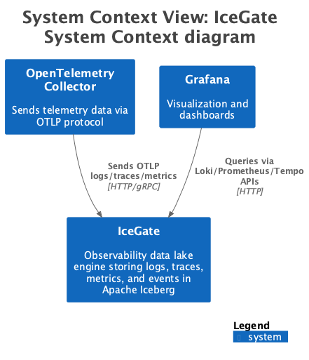
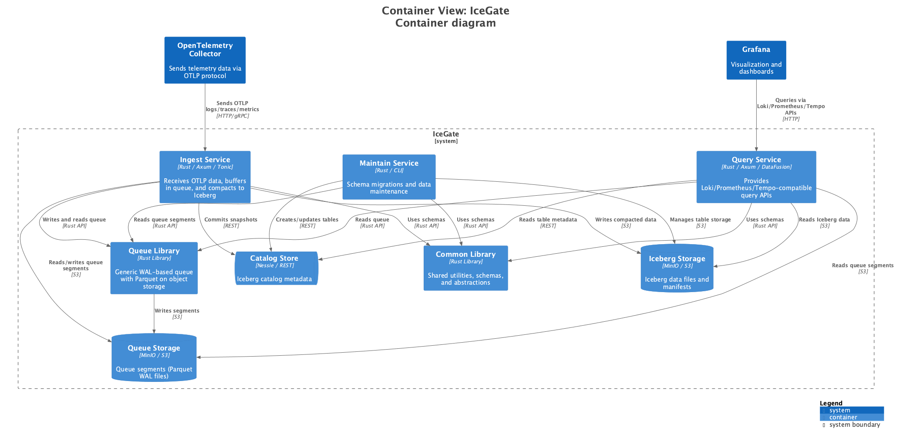
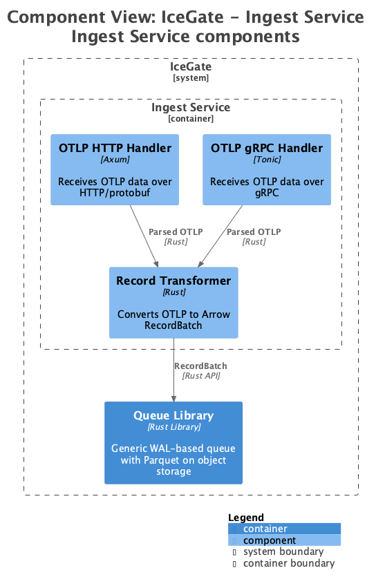
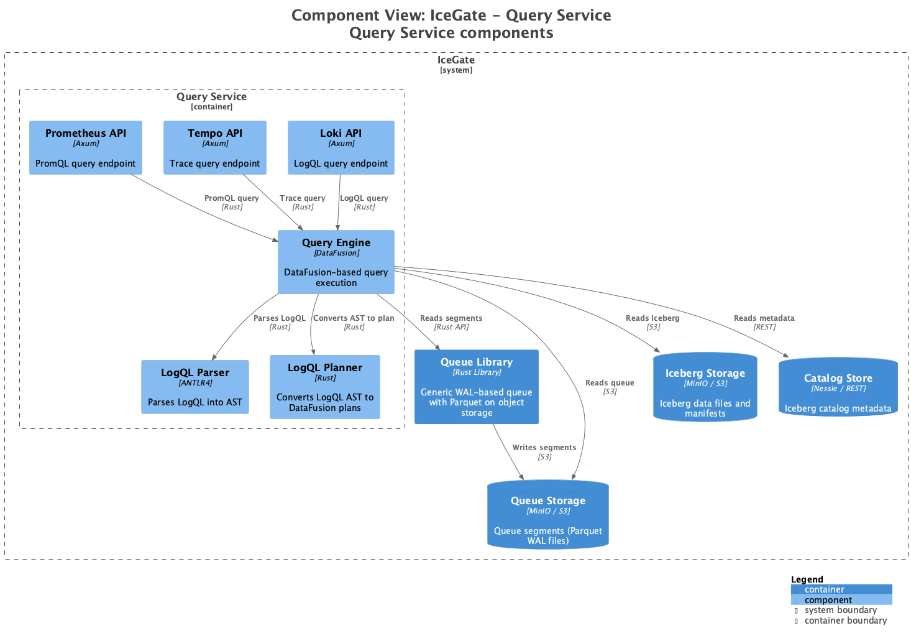
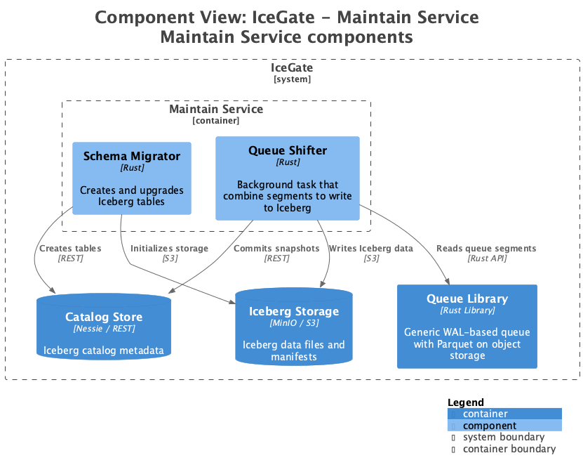

# Обзор Архитектуры



Эта страница находится в процессе перевода. Полную документацию смотрите в английской версии.



IceGate - движок озера данных наблюдаемости, который хранит логи, трейсы, метрики и события в таблицах Apache Iceberg.

## Принципы Проектирования

- **Разделение Вычислений и Хранения**: Независимое масштабирование обработки и хранения
- **Открытые Стандарты**: Построен на Apache Iceberg, Arrow, Parquet и OpenTelemetry
- **Экономичность**: Архитектура на основе объектного хранилища
- **ACID Транзакции**: Полная поддержка транзакций

## Контекст Системы

## Диаграмма Контейнеров

## Детали Компонентов

### Сервис Ingest

**Назначение:** Приём данных наблюдаемости через OpenTelemetry Protocol (OTLP)

- **Протоколы:** OTLP HTTP (порт 4318), OTLP gRPC (порт 4317)
- **Гарантия Доставки:** Exactly-once
- **Путь Записи:** Данные → WAL (Parquet) → Объектное Хранилище

### Сервис Query

**Назначение:** Выполнение запросов к логам, трейсам, метрикам и событиям

- **Движок:** Apache DataFusion + Apache Arrow
- **API:** Loki (3100), Prometheus (9090), Tempo (3200)
- **Языки Запросов:** LogQL, PromQL (планируется), TraceQL (планируется)

### Сервис Maintain

**Назначение:** Операции жизненного цикла и оптимизации данных

- **Компакция:** Слияние мелких WAL-файлов в оптимизированные таблицы Iceberg
- **TTL:** Истечение срока и удаление старых данных
- **Оптимизация:** Перезапись файлов для лучшей производительности
- **Очистка:** Удаление осиротевших файлов

### Сервис Alert (Планируется)

**Назначение:** Оповещения на основе правил для данных наблюдаемости

## Следующие Шаги

- Узнайте о [Модели Данных](data-model.md)
- Изучите опции [Развёртывания](../operations/deployment.md)
