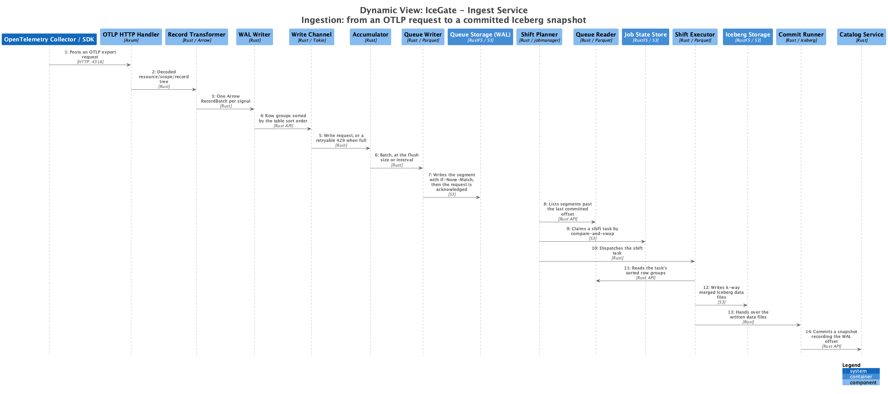
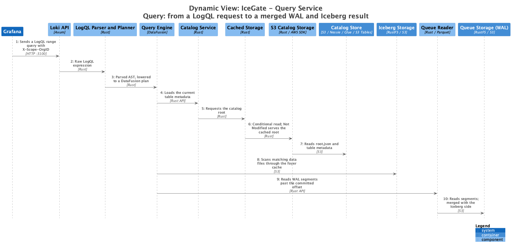
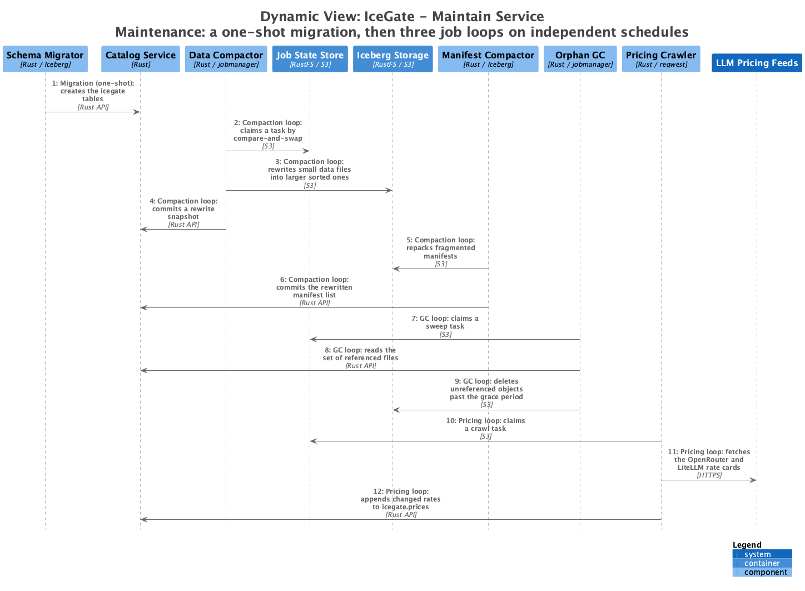

# Обзор Архитектуры

{{product_name}} - движок озера данных наблюдаемости, который хранит логи, трейсы, метрики, события и LLM-операции в таблицах Apache Iceberg с DataFusion в качестве движка запросов.

## Принципы Проектирования

- **Разделение Вычислений и Хранения**: Независимое масштабирование обработки и хранения
- **Открытые Стандарты**: Построен на Apache Iceberg, Arrow, Parquet и OpenTelemetry
- **Экономичность**: Архитектура на основе объектного хранилища минимизирует затраты на инфраструктуру
- **ACID Транзакции**: Полная поддержка транзакций без выделенной OLTP базы данных

## Контекст Системы

## Диаграмма Контейнеров

## Детали Компонентов

### Сервис Ingest

**Назначение:** Приём данных наблюдаемости через OpenTelemetry Protocol (OTLP)

- **Протоколы:** OTLP HTTP (порт 4318), OTLP gRPC (порт 4317)
- **Гарантия Доставки:** Exactly-once
- **Путь Записи:** Данные → WAL (Parquet) → Объектное Хранилище

Write-Ahead Log (WAL) хранит данные в виде файлов Parquet, организованных для совместимости со слоем хранения Iceberg. Файлы WAL могут быть запрошены напрямую для доступа к данным в реальном времени.

### Сервис Query

**Назначение:** Выполнение запросов к логам, трейсам, метрикам и событиям

- **Движок:** Apache DataFusion + Apache Arrow
- **API:** Loki (3100), Tempo (3200), Arrow Flight SQL (8815); Prometheus (9090) отдаёт маршруты, но его обработчики пока возвращают `501 Not Implemented`
- **Языки Запросов:** LogQL, TraceQL, SQL; PromQL планируется
- **Мультитенантность:** Тенант берётся из заголовка `X-Scope-OrgID` либо из gRPC-метаданных `x-scope-orgid` для Flight SQL

Arrow Flight SQL работает строго на чтение — DDL и DML отклоняются — и применяет `tenant_id` на уровне строк при каждом сканировании, поэтому клиенты JDBC, ODBC и ADBC обращаются к `iceberg.icegate.<table>` без специфичного для {{product_name}} клиентского кода.

Сервис запросов читает из двух источников:

- **WAL**: Данные в реальном времени (возрастом в секунды)
- **Таблицы Iceberg**: Исторические данные (перенесённые shift'ом и компактированные)

Границей между ними служит WAL-офсет, записанный в сводку снапшота Iceberg, поэтому строка читается ровно с одной стороны и никогда не учитывается дважды.

### Сервис Maintain

**Назначение:** Операции жизненного цикла и оптимизации данных

- **Миграция схемы:** Создание таблиц Iceberg (`maintain migrate create`)
- **Компакция данных:** Перезапись мелких Parquet-файлов в меньшее количество более крупных отсортированных файлов
- **Компакция манифестов:** Переупаковка фрагментированных манифестов Iceberg
- **GC осиротевших объектов:** Удаление объектов, на которые текущие метаданные таблицы больше не ссылаются, по истечении льготного периода
- **Краулер цен:** Сбор тарифов LLM из внешних источников в глобальную таблицу `icegate.prices`

Компакция, GC и краулер цен выполняются как задачи, состояние которых хранится в объектном хранилище под собственным префиксом состояния задач.

### Каталог

**Назначение:** Организация озера данных с ACID-транзакциями без выделенной OLTP базы данных

- **Бэкенд по умолчанию:** Собственный S3-каталог {{product_name}} — состояние каталога представляет собой объект `root.json`, обновляемый через compare-and-swap
- **Альтернативные бэкенды:** REST (Nessie), AWS S3 Tables, AWS Glue
- **Развёртывание:** По умолчанию встраивается в Ingest, Query и Maintain; опционально разворачивается отдельно как REST-сервер Iceberg на порту 8181

Условное чтение поддерживает актуальность закэшированного корня каталога; метаданные таблиц неизменяемы для каждого расположения, поэтому кэшируются безусловно в LRU.

### Сервис Alert (Планируется)

**Назначение:** Оповещения на основе правил для данных наблюдаемости

- Управление правилами для определения условий оповещения
- Анализ в реальном времени с использованием сервиса Query
- Генерация событий в соответствии с семантическими соглашениями OpenTelemetry

## Стек Технологий

| Компонент | Технология | Назначение |
|-----------|-----------|------------|
| Формат таблиц | Apache Iceberg 0.9 | ACID транзакции, time travel, эволюция схемы |
| Движок запросов | Apache DataFusion 52.2 | Векторизованное выполнение запросов |
| Формат в памяти | Apache Arrow 57.0 | Обработка данных без копирования |
| Формат хранения | Apache Parquet 57.0 | Колоночное хранение с ZSTD сжатием |
| Загрузка | OpenTelemetry 0.31 | Стандартный протокол наблюдаемости (gRPC + HTTP) |
| SQL-интерфейс | Arrow Flight SQL 57.0 | SQL только на чтение для клиентов JDBC, ODBC и ADBC |
| Каталог | S3-каталог (по умолчанию), Nessie, AWS S3 Tables, AWS Glue | Бэкенды каталога Iceberg; вариант по умолчанию хранит состояние в объектном хранилище |
| Объектное хранилище | RustFS или любое S3-совместимое хранилище | Сегменты WAL, данные Iceberg, состояние каталога, состояние задач |
| Job Manager | jobmanager (отдельный репозиторий) | Состояние задач shift, компакции, GC и цен на основе S3 |
| Кэширование | foyer 0.22 | Гибридный кэш память + диск для чтения из S3 |
| Язык | Rust {{rust_version}}+ (2024 edition) | Безопасная по памяти, высокопроизводительная среда выполнения |

## Поток Данных

### Поток Загрузки

Шаги 1-7 — это путь записи, подтверждаемый сразу после записи сегмента WAL. Шаги 8-14 — это shift, который выполняется независимо от запроса.

1. Клиент отправляет данные OTLP в сервис Ingest
2. Ingest валидирует и трансформирует данные
3. Данные записываются в WAL как файлы Parquet
4. Подтверждение отправляется клиенту (exactly-once)

### Поток Запросов

1. Клиент отправляет запрос в сервис Query
2. Запрос парсится и планируется DataFusion
3. Данные читаются из таблиц Iceberg и/или WAL
4. Результаты форматируются и возвращаются

### Поток Shift (Компакция)

1. Процесс shift сервиса Ingest отслеживает сегменты WAL
2. Группирует сегменты в задачи shift
3. Параллельно читает файлы WAL, объединяет и перепартиционирует данные
4. Записывает оптимизированные файлы данных Iceberg
5. Фиксирует новый снапшот в каталоге, записывая последний зафиксированный WAL-офсет в сводку снапшота

Shift никогда не удаляет сегменты WAL. Их освобождает правило жизненного цикла объектов на бакете очереди, а офсет в сводке снапшота — это то, что позволяет shift'у продолжить с места остановки.

### Поток Обслуживания

Миграция — разовая задача. Компакция, GC осиротевших объектов и краулер цен — независимые циклы со своими расписаниями: номера шагов упорядочивают каждый цикл, но не циклы между собой. Каждый резервирует работу под собственным префиксом состояния задач в объектном хранилище, поэтому они никогда не конкурируют друг с другом.

## Масштабируемость

### Горизонтальное Масштабирование

- **Ingest:** Масштабирование реплик для увеличения пропускной способности
- **Query:** Масштабирование реплик для параллельных запросов
- **Maintain:** Масштабирование реплик для большей пропускной способности перезаписи — воркеры разделяют состояние задач в объектном хранилище через compare-and-swap и фиксируют изменения с оптимистичной конкуренцией, поэтому параллельные экземпляры безопасны. Сначала предпочтительнее увеличить число воркеров внутри процесса; отдача от реплик снижается по мере их роста, так как все воркеры одной таблицы конкурируют за единственный объект состояния задач.

### Масштабирование Хранилища

- Объектное хранилище масштабируется независимо
- Без ограничений по ёмкости (оплата за использование)
- Поддержка кросс-региональной репликации

## Следующие Шаги

- Узнайте о [Модели Данных](data-model.md)
- Изучите опции [Развёртывания](../operations/deployment.md)
- Смотрите детали [Конфигурации](../getting-started/configuration.md)
